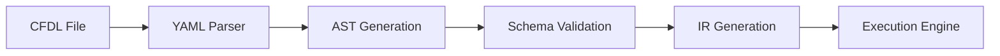

# CFDL - Cash Flow Domain Language

[](https://your-github-username.github.io/cfdl-project/)
[](https://github.com/your-github-username/cfdl-project/actions)
[](LICENSE)

**CFDL (Cash Flow Domain Language)** is a domain-specific language for financial modeling and cash flow analysis. It provides a structured, human-readable way to define complex financial models that can be processed, validated, and executed by automated systems.

## 🚀 Quick Start

### Prerequisites
- Java 11+
- Maven 3.6+
- Node.js 18+ (for documentation)

### Installation
```bash
git clone https://github.com/your-github-username/cfdl-project.git
cd cfdl-project
mvn clean compile
```

### Test with Example
```bash
mvn exec:java -Dexec.mainClass="dev.cfdl.Parser" -Dexec.args="examples/office-building-deal.cfdl"
```

## 📚 Documentation

### Online Documentation
Visit our comprehensive documentation at: **https://your-github-username.github.io/cfdl-project/**

### Local Documentation
To run documentation locally:
```bash
cd website
npm install
npm start
```

The documentation site will be available at `http://localhost:3000`.

## 🏗️ Project Structure

```
cfdl-project/
├── src/main/java/dev/cfdl/     # CFDL Parser & Pipeline
│   ├── Parser.java             # Main CFDL parser
│   ├── ASTBuilder.java         # AST generation
│   ├── IRBuilder.java          # IR transformation
│   ├── SchemaValidator.java    # Schema validation
│   └── ...
├── ontology/                   # JSON Schema definitions
│   ├── entity/                 # Entity schemas (Deal, Asset, etc.)
│   ├── behavior/               # Behavior schemas (Stream, etc.)
│   ├── temporal/               # Temporal schemas (Schedule, etc.)
│   └── result/                 # Result schemas (CashFlow, etc.)
├── examples/                   # Sample CFDL models
│   ├── office-building-deal.cfdl
│   ├── multi-asset-portfolio.cfdl
│   ├── renewable-energy-project.cfdl
│   └── atomic-cash-flows-commercial-real-estate.cfdl
├── website/                    # Documentation site (Docusaurus)
│   ├── docs/                   # Documentation content
│   ├── src/                    # Site components
│   └── docusaurus.config.ts    # Site configuration
├── scripts/                    # Automation scripts
└── .github/workflows/          # CI/CD pipelines
```

## 💼 Use Cases

### Commercial Real Estate
```yaml
deal:
  OfficeBuilding:
    name: "Downtown Office Building"
    dealType: commercial_real_estate
    
    assets:
      - asset:
          MainBuilding:
            category: real_estate
            streams:
              - stream:
                  RentalIncome:
                    category: Revenue
                    amount: 50000
                    schedule:
                      type: recurring
                      freq: monthly
```

### Infrastructure & Energy
```yaml
deal:
  SolarFarm:
    name: "100MW Solar Farm"
    dealType: renewable_energy_project
    
    streams:
      - stream:
          ITC_Benefit:
            name: "Investment Tax Credit"
            category: Revenue
            subType: Tax
            amount: 30000000
```

## 🔄 Processing Pipeline



1. **Parse**: CFDL files using robust YAML processing
2. **Build**: Abstract Syntax Trees with universal node structure
3. **Validate**: Comprehensive schema and business rule validation
4. **Transform**: Intermediate Representation for execution engines
5. **Execute**: Ready for cash flow generation and analysis

## 🛠️ Development

### Running Tests
```bash
mvn test
```

### Building Documentation
```bash
cd website
npm run build
```

### Generating Schema Documentation
```bash
python3 scripts/generate_schema_docs.py
```

### Code Style
We use standard Java conventions. See [Contributing Guide](website/docs/developer/contributing.md) for details.

## 📖 Examples

### Simple Rental Property
```yaml
deal:
  RentalProperty:
    name: "4-Unit Apartment Building"
    dealType: commercial_real_estate
    currency: "USD"
    
    assets:
      - asset:
          ApartmentBuilding:
            name: "Main Building"
            dealId: "RentalProperty"
            category: real_estate
            
            streams:
              - stream:
                  RentalIncome:
                    name: "Monthly Rent"
                    scope: asset
                    category: Revenue
                    amount: 3200
                    
                    schedule:
                      type: recurring
                      startDate: 2024-01-01
                      recurrenceRule:
                        freq: monthly
                        interval: 1
```

See [`examples/`](examples/) directory for more comprehensive models.

## 🎯 Features

### ✅ Current (v1.0)
- [x] YAML-based syntax with .cfdl extension
- [x] Comprehensive JSON schema validation (29 schemas)
- [x] Hierarchical modeling (Deal → Asset → Component → Stream)
- [x] Universal AST node architecture
- [x] Intermediate Representation generation
- [x] Schema-driven validation with detailed error reporting
- [x] Support for complex financial structures
- [x] Commercial real estate modeling
- [x] Infrastructure & renewable energy projects
- [x] Multi-asset portfolio support
- [x] Component-level cash flow modeling

### 🚧 Roadmap (Future)
- [ ] Execution engine integration
- [ ] Cash flow generation and aggregation
- [ ] Financial metrics calculation (NPV, IRR, DSCR)
- [ ] Monte Carlo simulation support
- [ ] Waterfall distribution modeling
- [ ] Multi-currency support
- [ ] Time-series data integration
- [ ] Interactive model builder UI
- [ ] Advanced calculator library
- [ ] Custom logic block support

## 📊 Documentation Sections

### For Business Users
- **[What is CFDL?](website/docs/overview/what-is-cfdl.md)** - Executive overview
- **[Use Cases](website/docs/overview/use-cases.md)** - Business scenarios
- **[Getting Started](website/docs/overview/getting-started.md)** - Quick start guide

### For Model Authors
- **[Best Practices](website/docs/authoring/best-practices.md)** - Modeling guidelines
- **[Examples Gallery](website/docs/authoring/examples-gallery.md)** - Working examples
- **[Entity Guide](website/docs/authoring/entity-guide.md)** - When to use what

### For Developers
- **[CFDL v1.0 Specification](website/docs/specification/cfdl-v1-spec.md)** - Complete language spec
- **[Schema Reference](website/docs/specification/ontology-reference.md)** - All 29 schemas
- **[API Reference](website/docs/developer/api-reference.md)** - Java API docs
- **[Architecture](website/docs/architecture/system-overview.md)** - Technical design

## 🤝 Contributing

We welcome contributions! Please see our [Contributing Guide](website/docs/developer/contributing.md) for details.

### Quick Contribution Guide
1. Fork the repository
2. Create a feature branch (`git checkout -b feature/amazing-feature`)
3. Make your changes
4. Add tests if applicable
5. Update documentation
6. Commit your changes (`git commit -m 'Add amazing feature'`)
7. Push to the branch (`git push origin feature/amazing-feature`)
8. Open a Pull Request

## 📄 License

This project is licensed under the MIT License - see the [LICENSE](LICENSE) file for details.

## 🔗 Links

- **Documentation**: https://your-github-username.github.io/cfdl-project/
- **Issues**: https://github.com/your-github-username/cfdl-project/issues
- **Discussions**: https://github.com/your-github-username/cfdl-project/discussions
- **Examples**: [examples/](examples/) directory

## 🏆 Acknowledgments

- Built with [Jackson YAML](https://github.com/FasterXML/jackson-dataformats-text) for robust parsing
- Uses [JSON Schema Validator](https://github.com/java-json-tools/json-schema-validator) for validation
- Documentation powered by [Docusaurus](https://docusaurus.io/)
- Continuous deployment via [GitHub Actions](https://github.com/features/actions)

---

**Happy Modeling with CFDL!** 🚀

For questions, issues, or contributions, please visit our [GitHub repository](https://github.com/your-github-username/cfdl-project).