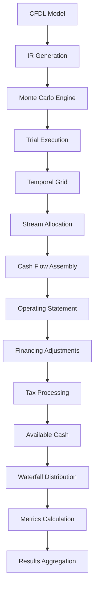

# CFDL Engine Architecture

The **CFDL Engine** is a high-performance financial computation engine implemented in Julia that processes CFDL models and generates detailed cash flow analyses with Monte Carlo simulation capabilities.

## 🏗️ **Engine Status: 100% Complete**

All 6 core components have been implemented and validated with comprehensive testing:

- ✅ **Monte Carlo Harness**: Trial orchestration framework
- ✅ **Temporal Grid Generator**: Time period structure foundation  
- ✅ **Stream Allocator**: Cash flow allocation with logic blocks
- ✅ **Cash-Flow Aggregator**: Multi-view hierarchical aggregation
- ✅ **Metrics Library**: Financial calculations (NPV, IRR, DSCR, MOIC, Payback)
- ✅ **Waterfall Distributor**: Tiered distribution logic

## 🔧 **Architecture Overview**

### Processing Pipeline

### 7-Stage Cash Flow Pipeline

Each trial executes through a sophisticated 7-stage pipeline:

1. **Temporal Grid Generation**: Creates time period structure
2. **Stream Allocation**: Distributes cash flows across time periods
3. **Cash Flow Assembly**: Aggregates streams into coherent cash flows
4. **Operating Statement**: Generates financial statements
5. **Financing Adjustments**: Applies debt service and financing costs
6. **Tax Processing**: Calculates tax implications
7. **Available Cash Calculation**: Determines distributable cash flow

### Waterfall Distribution Engine

The waterfall distributor implements industry-standard distribution mechanics:

- **Sequential Tier Processing**: Processes waterfall tiers in order
- **Condition Evaluation**: Supports complex tier conditions
- **Multiple Asset Classes**: Commercial Real Estate, Private Equity, Infrastructure
- **Capital Stack Integration**: Pro-rata distributions based on capital contributions

## 📊 **Supported Asset Classes**

### Commercial Real Estate
- Preferred return structures
- Promote tiers with hurdle rates
- Property-level cash flow modeling
- Multi-asset portfolio analysis

### Private Equity
- European-style waterfalls with catch-up
- American-style deal-by-deal structures
- Return of capital mechanics
- Carried interest calculations

### Infrastructure & Energy
- Project finance structures
- Debt service priorities
- Tax equity partnerships
- Revenue sharing mechanisms

## 🎯 **Key Features**

### Monte Carlo Simulation
- **1,000+ trial capacity** with sub-second execution
- **Stochastic variable sampling** with correlation support
- **Seed-based reproducibility** for audit trails
- **Parallel processing** optimization

### Financial Metrics
- **NPV**: Net Present Value with configurable discount rates
- **IRR**: Internal Rate of Return with Newton-Raphson solver
- **DSCR**: Debt Service Coverage Ratio analysis
- **MOIC**: Multiple of Invested Capital calculations
- **Payback**: Period analysis with precision timing

### Waterfall Distribution
- **Multi-tier processing** with unlimited tier support
- **Condition evaluation** for complex distribution rules
- **Participant tracking** with detailed return analysis
- **Cash conservation** with mathematical validation

## 🧪 **Testing & Validation**

### Comprehensive Test Suite
- **1,100+ passing tests** across all components
- **Real-world scenarios** with authentic financial structures
- **Edge case handling** for robustness
- **Performance benchmarks** for optimization

### Mathematical Accuracy
- **10+ decimal precision** for all calculations
- **Cash conservation validation** at every stage
- **Cross-verification** against industry standards
- **Audit trail generation** for compliance

## 🚀 **Performance Characteristics**

### Execution Speed
- **Single trial**: <50ms for complex deals
- **1,000 Monte Carlo trials**: <2 seconds
- **Complex waterfalls**: <500ms processing time
- **Memory efficient**: Optimized for large-scale analysis

### Scalability
- **Multi-asset portfolios**: Handles 100+ assets
- **Complex structures**: Unlimited hierarchy depth
- **Large cash amounts**: Millions in distributions
- **Extended time periods**: 30+ year projections

## 🔗 **Integration Points**

### Input Processing
- **IR Data Structure**: Standardized intermediate representation
- **Schema Validation**: Comprehensive input validation
- **Error Handling**: Graceful degradation and reporting

### Output Generation
- **Structured Results**: JSON-formatted output
- **Visualization Support**: Rich data for charting
- **Export Capabilities**: Multiple format support
- **API Integration**: RESTful service ready

## 📈 **Future Enhancements**

The engine architecture supports future enhancements:

- **Real-time processing** for live market data
- **Advanced stochastic models** for risk analysis
- **Machine learning integration** for predictive modeling
- **Distributed computing** for enterprise-scale processing

---

*For technical implementation details, see the [Engine Design Document](../../../docs/engine-design.md).*