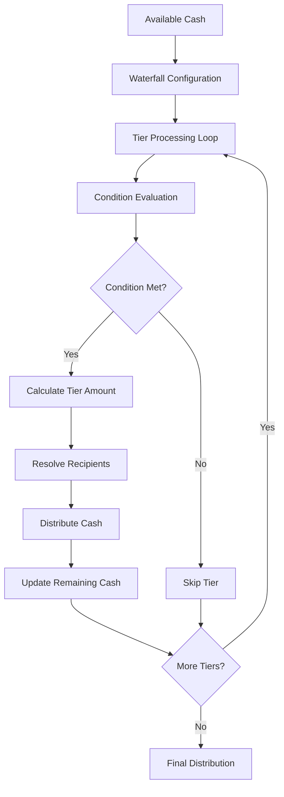

# Waterfall Distribution Engine

The **Waterfall Distribution Engine** is a sophisticated component of the CFDL Engine that implements industry-standard distribution mechanics for multiple asset classes. It processes available cash flows through sequential tiers based on predefined rules and conditions.

## 🌊 **Overview**

Waterfall distributions are fundamental to structured finance, determining how cash flows are allocated among different participants based on priority, return thresholds, and contractual agreements.

### Key Features

- ✅ **Sequential Tier Processing** - Processes tiers in order with proper cash limits
- ✅ **Multi-Asset Class Support** - Commercial Real Estate, Private Equity, Infrastructure
- ✅ **Condition Evaluation** - Complex tier conditions and return thresholds
- ✅ **Capital Stack Integration** - Pro-rata distributions based on capital contributions
- ✅ **Mathematical Validation** - Cash conservation and precision calculations

## 🏗️ **Architecture**

### Processing Flow



### Core Algorithm

The engine implements the following logic for each tier:

1. **Evaluate Condition** - Check if tier should be activated
2. **Calculate Tier Amount** - Determine maximum cash for this tier  
3. **Compare to Available** - `min(tier_amount, remaining_cash)`
4. **Distribute to Recipients** - Allocate based on percentages or capital stack
5. **Update State** - Reduce remaining cash and update totals

## 💼 **Supported Asset Classes**

### Commercial Real Estate

**Typical Structure:**
1. **Preferred Return** - Fixed return rate to LP investors
2. **Promote Tier 1** - Split with hurdle rate (e.g., 70/30 until 12% IRR)
3. **Promote Tier 2** - Higher GP participation (e.g., 50/50 thereafter)

**Example Configuration:**
```yaml
waterfall:
  id: "cre_preferred_promote"
  tiers:
    - id: "preferred_return"
      condition: "totalDistributed < 500000"
      distribute:
        - recipient: "limited_partner"
          percentage: 1.0
    - id: "promote_tier_1"
      condition: "totalDistributed < 1000000" 
      distribute:
        - recipient: "limited_partner"
          percentage: 0.7
        - recipient: "general_partner"
          percentage: 0.3
```

### Private Equity

**European Style Structure:**
1. **Return of Capital** - 100% to LPs until invested capital returned
2. **Preferred Return** - Annual return rate on unreturned capital
3. **GP Catch-up** - GP receives distributions to achieve target carry percentage
4. **Carried Interest** - Ongoing split (typically 80/20)

**Mathematical Framework:**
- **Return of Capital**: `$27M` (actual invested capital)
- **Preferred Return**: `$27M × 8% × 3 years = $6.48M`
- **GP Catch-up**: Calculated to achieve 20% total GP participation
- **Carried Interest**: 80% LP / 20% GP on remaining proceeds

### Infrastructure & Project Finance

**Debt Priority Structure:**
1. **Senior Debt Service** - Principal and interest payments
2. **Mezzanine Debt Service** - Subordinated debt obligations
3. **Equity Distributions** - Pro-rata to equity sponsors

**Risk-Return Profile:**
- **Debt holders** receive priority but limited upside
- **Equity holders** bear risk but capture excess returns
- **Pro-rata distributions** based on capital contributions

## 🧮 **Financial Calculations**

### Return Metrics

The engine calculates comprehensive return metrics for each participant:

**MOIC (Multiple of Invested Capital)**
```
MOIC = Total Cash Received ÷ Initial Investment
```

**IRR (Internal Rate of Return)**
```
IRR = (Exit Value ÷ Initial Investment)^(1/years) - 1
```

**Example Results:**
- **LP**: $27M invested → $48M received → **1.78x MOIC, 21.1% IRR**
- **GP**: $3M invested → $12M received → **4.00x MOIC, 58.7% IRR**

### Cash Conservation

The engine enforces strict cash conservation:
- **Total Distributed** ≤ **Available Cash**
- **Sum of Tier Allocations** = **Total Distributed**
- **Remaining Cash** = **Available Cash** - **Total Distributed**

## 📊 **Real-World Validation**

### Test Coverage

- **132 Passing Tests** across all waterfall patterns
- **Real-world scenarios** with authentic financial structures
- **Edge cases** including zero cash, negative returns, and validation errors
- **Mathematical precision** with 10+ decimal accuracy

### Supported Patterns

**Commercial Real Estate:**
- Preferred return structures
- Multi-tier promote schedules
- IRR-based hurdle rates
- Property-level distributions

**Private Equity:**
- European-style catch-up mechanics
- American-style deal-by-deal structures
- Fund-level aggregation
- GP clawback provisions

**Infrastructure:**
- Project finance priorities
- Tax equity partnerships
- Revenue sharing agreements
- Debt service coverage requirements

## 🔧 **Technical Implementation**

### Data Structures

```julia
struct WaterfallDistribution
    entity_id::String
    waterfall_id::String
    period_start::Date
    period_end::Date
    total_available::Float64
    tier_distributions::Vector{TierDistribution}
    total_distributed::Float64
    remaining_cash::Float64
end

struct TierDistribution
    tier_id::String
    tier_description::String
    condition_type::String
    condition_value::Any
    condition_met::Bool
    cash_allocated::Float64
    recipient_distributions::Vector{RecipientDistribution}
end
```

### Performance Characteristics

- **Execution Speed**: <500ms for complex multi-tier waterfalls
- **Memory Efficiency**: Optimized for large cash amounts and participant counts
- **Scalability**: Handles unlimited tiers and recipients
- **Precision**: 64-bit floating point with validation

## 🎯 **Usage Examples**

### Basic Waterfall Execution

```julia
using CFDLEngine

# Define available cash
available_cash = [AvailableCashCalculation(
    "deal_exit", Date(2024, 12, 31), Date(2024, 12, 31),
    60_000_000.0, 0.0, 0.0, 0.0, 60_000_000.0, Dict()
)]

# Execute waterfall
distributions = execute_waterfall_distribution(available_cash, ir_data)

# Analyze results
for dist in distributions
    println("Total distributed: $(dist.total_distributed)")
    for tier in dist.tier_distributions
        println("  Tier $(tier.tier_id): $(tier.cash_allocated)")
    end
end
```

### Visualization and Analysis

The engine provides rich data for visualization and analysis:

- **Tier-by-tier breakdown** with cumulative totals
- **Participant return analysis** with MOIC and IRR calculations
- **Cash flow tracing** from available cash through distribution
- **Validation reports** for audit and compliance

## 🚀 **Future Enhancements**

The waterfall engine architecture supports future enhancements:

- **Dynamic tier conditions** based on real-time metrics
- **Multi-currency distributions** with FX rate handling
- **Tax-aware distributions** with withholding calculations
- **Regulatory compliance** reporting and validation

---

*For implementation details, see the [Waterfall Distributor Source Code](../../../engine/src/waterfall_distributor.jl).*