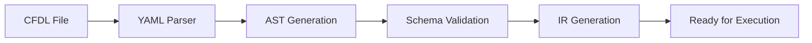

# Welcome to CFDL Documentation

Welcome to the **Cash Flow Domain Language (CFDL)** documentation!

CFDL is a domain-specific language designed for financial modeling and cash flow analysis. This documentation will help you understand how to use CFDL to create sophisticated financial models.

## 🚀 Quick Start

New to CFDL? Start here:

1. **[What is CFDL?](overview/what-is-cfdl.md)** - Learn about CFDL and its capabilities
2. **[Getting Started](overview/getting-started.md)** - Create your first CFDL model
3. **[Best Practices](authoring/best-practices.md)** - Learn how to write maintainable models

## 📚 Documentation Sections

### Overview
Get familiar with CFDL concepts and see what's possible.

### CFDL Specification
Complete technical specification including all 29 schemas that define the CFDL language.

### Authoring Guide
Best practices, patterns, and guidelines for creating effective CFDL models.

## 🔄 Processing Pipeline

## 💼 Use Cases

CFDL supports modeling for:

- **Commercial Real Estate**: Multi-asset portfolios, property-level analysis
- **Infrastructure & Energy**: Renewable energy projects, tax credit modeling
- **Private Equity**: Fund-level modeling, waterfall distributions

## 🛠️ Implementation Status

**Current (v1.0)**: ✅ Complete
- YAML-based parsing with .cfdl extension
- 29 comprehensive JSON schemas
- AST generation and IR transformation
- Full validation pipeline

## Need Help?

- Browse the [Getting Started Guide](overview/getting-started.md)
- Check out [Best Practices](authoring/best-practices.md)
- Review the [Complete Specification](specification/cfdl-v1-spec.md)
- Explore all [Schema Definitions](specification/ontology-reference.md)

Ready to start modeling? Let's go! 🚀