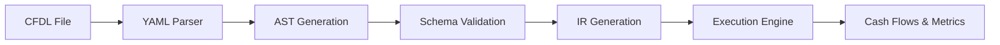

# What is CFDL?

**CFDL (Cash Flow Domain Language)** is a domain-specific language designed for financial modeling and cash flow analysis. It provides a structured, human-readable way to define complex financial models that can be processed, validated, and executed by automated systems.

## 🎯 Purpose

CFDL addresses the challenge of creating **maintainable, auditable, and reusable financial models** by providing:

- **Structured syntax** based on YAML for readability
- **Schema validation** to ensure model correctness
- **Hierarchical modeling** for complex deal structures
- **Automated processing** from model definition to cash flow generation

## 🏗️ Key Concepts

### Domain Hierarchy
```
Deal
├── Assets
│   ├── Components
│   └── Streams (Revenue/Expense)
└── Deal-level Streams
```

### Core Entities
- **Deals**: Top-level financial structures (real estate, infrastructure, etc.)
- **Assets**: Physical or financial assets within a deal
- **Components**: Sub-components of assets (units, tranches, etc.)
- **Streams**: Cash flow generators (revenue, expenses, financing)

### Behavioral Elements
- **Schedules**: Timing definitions for cash flows
- **Assumptions**: Model parameters and variables
- **Logic Blocks**: Custom business logic
- **Market Data**: External data sources

## 💼 Use Cases

### Commercial Real Estate
- Multi-asset portfolio modeling
- Property-level cash flow analysis
- Component-level revenue tracking
- Disposition modeling

### Infrastructure & Energy
- Renewable energy project financing
- Infrastructure development deals
- Tax credit modeling (ITC, MACRS)
- Long-term PPA analysis

### Private Equity & Investment
- Fund-level cash flow modeling
- Portfolio company analysis
- Waterfall distributions
- Capital calls and distributions

## 🔄 Processing Pipeline



1. **Parse**: CFDL files are parsed using robust YAML processing
2. **Validate**: Models are validated against comprehensive JSON schemas
3. **Transform**: Abstract Syntax Trees are built with full validation
4. **Execute**: Intermediate Representation feeds execution engines
5. **Analyze**: Generate cash flows, metrics, and financial analysis

## 🎨 Example

Here's a simple CFDL model:

```yaml
deal:
  OfficeBuilding_Example:
    name: "Downtown Office Building"
    dealType: commercial_real_estate
    currency: "USD"
    
    assets:
      - asset:
          MainBuilding:
            name: "Main Office Building"
            dealId: "OfficeBuilding_Example"
            category: real_estate
            
            streams:
              - stream:
                  RentalIncome:
                    name: "Monthly Rental Income"
                    scope: asset
                    category: Revenue
                    amount: 50000
                    
                    schedule:
                      type: recurring
                      startDate: 2024-01-01
                      recurrenceRule:
                        freq: monthly
                        interval: 1
```

This simple example defines:
- A commercial real estate deal
- One office building asset
- Monthly rental income stream of $50,000

## 🚀 Getting Started

Ready to start modeling with CFDL? Check out our [Getting Started Guide](./getting-started.md) for step-by-step instructions.

For technical details, see our [CFDL v1.0 Specification](../specification/cfdl-v1-spec.md).